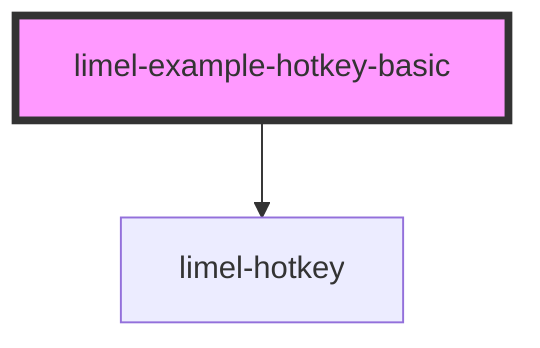

# limel-example-hotkey-basic

<!-- Auto Generated Below -->

## Overview

Basic example

The value is passed as a string

## Dependencies

### Depends on

- [limel-hotkey](..)

### Graph

----------------------------------------------

*Built with [StencilJS](https://stenciljs.com/)*
