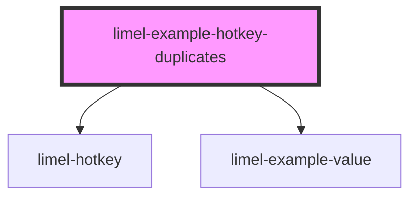

# limel-example-hotkey-duplicates

<!-- Auto Generated Below -->

## Overview

Duplicate hotkeys

If multiple enabled `<limel-hotkey>` instances are configured with the same
hotkey (after normalization), only the first handler will run for each
keypress. This prevents multiple actions from being triggered by a single
keyboard event.

When a duplicate is detected at runtime, the first handler will log a
`console.warn` (once per keypress) to help you spot and fix the conflict.

:::note
Disabled instances are not counted and never emit events.
:::

- Press `2`.
- Only one `hotkeyTrigger` will fire (the first handler wins).
- A `console.warn` is logged to help you find the duplicate.

This behavior is intentional: triggering multiple actions from a single
keypress is usually surprising and can be unsafe.

## Dependencies

### Depends on

- [limel-hotkey](..)
- [limel-example-value](../../../examples)

### Graph

----------------------------------------------

*Built with [StencilJS](https://stenciljs.com/)*
