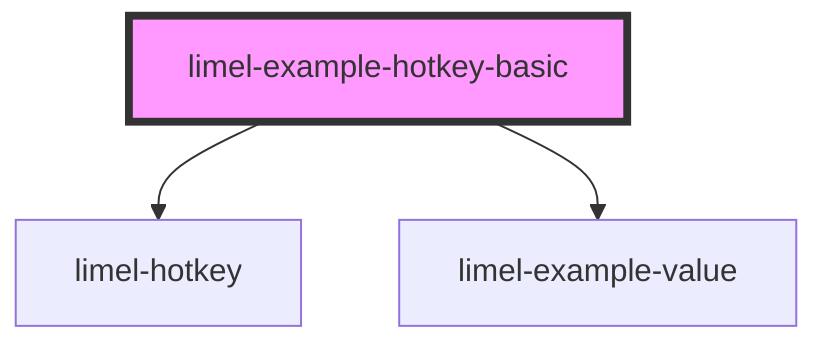

# limel-example-hotkey-basic

<!-- Auto Generated Below -->

## Overview

Basic example

The value is passed as a string, indicating which hotkey to listen for.

The component will automatically detect the operating system, and
render the hotkey accordingly, using standard glyphs to save space.

For example, the "meta" key will be rendered as <kbd>⌘</kbd> on macOS,
and as <kbd>⊞ Win</kbd> on Windows/Linux. Or the "alt" key will be rendered
as <kbd>⌥</kbd> on macOS, and as <kbd>Alt</kbd> on Windows.

:::note
`meta` always means the actual Meta key.

This component will render `meta` using platform conventions:
- macOS/iOS/iPadOS: <kbd>⌘</kbd>
- Windows/Linux: <kbd>⊞ Win</kbd>

If you want a hotkey that differs between operating systems (for example
⌘+C on macOS and Ctrl+C on Windows/Linux), detect the OS in your application
and pass the appropriate hotkey string.

- `ctrl` means “Control specifically” on all platforms.
- `cmd` or `command` always render as <kbd>⌘</kbd> (even on Windows/Linux),
and are normalized as aliases for `meta` when matching.
:::

## Dependencies

### Depends on

- [limel-hotkey](..)
- [limel-example-value](../../../examples)

### Graph

----------------------------------------------

*Built with [StencilJS](https://stenciljs.com/)*
