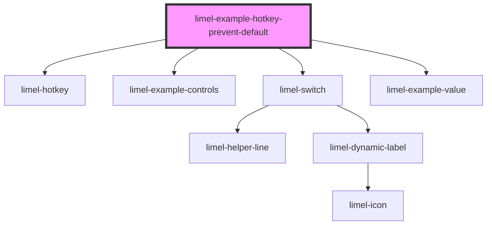

<!-- Auto Generated Below -->

## Overview

Prevent browser defaults

By default, matching hotkeys call `event.preventDefault()` to avoid browser
shortcuts (for example Save/Print dialogs) firing together with your app
action.

Use `preventBrowserDefault={false}` when you explicitly want to keep the
browser's native behavior.

Try this example:
- Keep "Prevent browser defaults" enabled and press
<kbd>Ctrl</kbd>/<kbd>⌘</kbd> + <kbd>S</kbd> or <kbd>P</kbd>:
browser defaults are prevented.
- Disable the switch and press the same hotkeys again:
browser defaults are allowed.

## Dependencies

### Depends on

- [limel-hotkey](..)
- [limel-example-controls](../../../examples)
- [limel-switch](../../switch)
- [limel-example-value](../../../examples)

### Graph

----------------------------------------------

*Built with [StencilJS](https://stenciljs.com/)*
