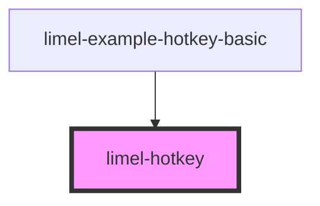

# limel-hotkey

<!-- Auto Generated Below -->

## Overview

This component is used internally to visualize hotkeys in other components,
such as the menu. It will also emit an event when the hotkey is pressed,
so that the parent component can react to it.

## Properties

| Property | Attribute | Description | Type     | Default     |
| -------- | --------- | ----------- | -------- | ----------- |
| `value`  | `value`   | The hotkey  | `string` | `undefined` |

## Events

| Event           | Description                                  | Type                                                                            |
| --------------- | -------------------------------------------- | ------------------------------------------------------------------------------- |
| `hotkeyTrigger` | Emits when the configured hotkey is pressed. | `CustomEvent<{ hotkey: string; value: string; keyboardEvent: KeyboardEvent; }>` |

## Dependencies

### Used by

 - [limel-example-hotkey-basic](examples)

### Graph

----------------------------------------------

*Built with [StencilJS](https://stenciljs.com/)*
