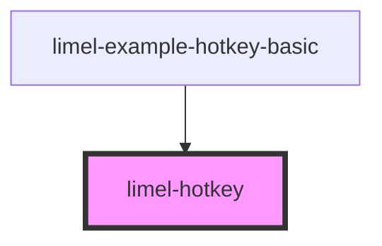

# limel-hotkey

<!-- Auto Generated Below -->

## Overview

This component is used internally to visualize hotkeys in other components,
such as the menu.

## Properties

| Property | Attribute | Description | Type     | Default     |
| -------- | --------- | ----------- | -------- | ----------- |
| `value`  | `value`   | The hotkey  | `string` | `undefined` |

## Dependencies

### Used by

 - [limel-example-hotkey-basic](examples)

### Graph

----------------------------------------------

*Built with [StencilJS](https://stenciljs.com/)*
