# limel-icon-button

<!-- Auto Generated Below -->

## Properties

| Property   | Attribute  | Description                                                                                    | Type             | Default     |
| ---------- | ---------- | ---------------------------------------------------------------------------------------------- | ---------------- | ----------- |
| `disabled` | `disabled` | Set to `true` to disable the button.                                                           | `boolean`        | `false`     |
| `elevated` | `elevated` | Set to `true` to give the button our standard "elevated" look, lifting it off the flat layout. | `boolean`        | `false`     |
| `icon`     | `icon`     | The icon to display.                                                                           | `Icon \| string` | `undefined` |
| `label`    | `label`    | The text to show to screenreaders and other assistive tech.                                    | `string`         | `undefined` |

## Dependencies

### Used by

 - [limel-collapsible-section](../collapsible-section)
 - [limel-example-dialog-heading-actions](../dialog/examples)
 - [limel-example-header-colors](../header/examples)
 - [limel-example-header-responsive](../header/examples)
 - [limel-example-icon-button-basic](examples)
 - [limel-example-icon-button-composite](examples)
 - [limel-example-icon-button-disabled](examples)
 - [limel-example-icon-button-elevated](examples)
 - [limel-example-icon-button-icon](examples)
 - [limel-example-icon-button-toggle-state](examples)
 - [limel-example-menu-hotkeys](../menu/examples)
 - [limel-example-menu-notification](../menu/examples)
 - [limel-example-tooltip-max-character](../tooltip/examples)
 - [limel-list-item](../list-item)
 - [limel-profile-picture](../profile-picture)
 - [limel-snackbar](../snackbar)

### Depends on

- [limel-icon](../icon)
- [limel-tooltip](../tooltip)

### Graph

```mermaid
graph TD;
  limel-icon-button --> limel-icon
  limel-icon-button --> limel-tooltip
  limel-tooltip --> limel-portal
  limel-tooltip --> limel-tooltip-content
  limel-collapsible-section --> limel-icon-button
  limel-example-dialog-heading-actions --> limel-icon-button
  limel-example-header-colors --> limel-icon-button
  limel-example-header-responsive --> limel-icon-button
  limel-example-icon-button-basic --> limel-icon-button
  limel-example-icon-button-composite --> limel-icon-button
  limel-example-icon-button-disabled --> limel-icon-button
  limel-example-icon-button-elevated --> limel-icon-button
  limel-example-icon-button-icon --> limel-icon-button
  limel-example-icon-button-toggle-state --> limel-icon-button
  limel-example-menu-hotkeys --> limel-icon-button
  limel-example-menu-notification --> limel-icon-button
  limel-example-tooltip-max-character --> limel-icon-button
  limel-list-item --> limel-icon-button
  limel-profile-picture --> limel-icon-button
  limel-snackbar --> limel-icon-button
  style limel-icon-button fill:#f9f,stroke:#333,stroke-width:4px
```

----------------------------------------------

*Built with [StencilJS](https://stenciljs.com/)*
