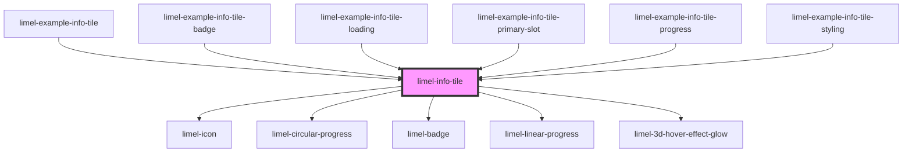

<!-- Auto Generated Below -->

## Overview

This component can be used on places such as a start page or a dashboard.
It offers features for visualizing aggregated data along with supplementary
information.

If clicking on the component should navigate the user to
a new screen or web page, you need to provide a URL,
using the `link` property.

## Properties

| Property   | Attribute  | Description                                                                                                                                                                                                                                                                                                                                                                                                                                                          | Type               | Default     |
| ---------- | ---------- | -------------------------------------------------------------------------------------------------------------------------------------------------------------------------------------------------------------------------------------------------------------------------------------------------------------------------------------------------------------------------------------------------------------------------------------------------------------------- | ------------------ | ----------- |
| `badge`    | `badge`    | If supplied, the info tile will display a notification badge.                                                                                                                                                                                                                                                                                                                                                                                                        | `number \| string` | `undefined` |
| `disabled` | `disabled` | Set to `true` if info tile is disabled.                                                                                                                                                                                                                                                                                                                                                                                                                              | `boolean`          | `false`     |
| `icon`     | `icon`     | Name of icon for the info tile.                                                                                                                                                                                                                                                                                                                                                                                                                                      | `string`           | `undefined` |
| `label`    | `label`    | The text to show below the info tile. Long labels will be truncated.                                                                                                                                                                                                                                                                                                                                                                                                 | `string`           | `null`      |
| `link`     | --         | If supplied, the info tile will be a clickable link.  Supplying a value also adds an elevated effect using a shadow, as well as `cursor: pointer`, which appears on hover. While we strongly recommend supplying a link whenever the component should act as a link, if this is not possible, and you need to provide interaction through a click handler, you can still get the correct styling by supplying a `Link` object with the `href` property set to `'#'`. | `Link`             | `undefined` |
| `loading`  | `loading`  | Set to `true` to put the component in the `loading` state. This does _not_ disable the link. To do so, the `disabled` property should be set to `true` as well.                                                                                                                                                                                                                                                                                                      | `boolean`          | `false`     |
| `prefix`   | `prefix`   | A string of text that is visually placed before the value.                                                                                                                                                                                                                                                                                                                                                                                                           | `string`           | `undefined` |
| `progress` | --         | Properties of the optional circular progress bar.  Defaults: - `maxValue`: 100 - `suffix`: % - `displayPercentageColors`: false  Colors change with intervals of 10 %.                                                                                                                                                                                                                                                                                               | `InfoTileProgress` | `undefined` |
| `suffix`   | `suffix`   | A string of text that is visually placed after the value.                                                                                                                                                                                                                                                                                                                                                                                                            | `string`           | `undefined` |
| `value`    | `value`    | A piece of text or number that is the main piece of information which the component is intended to visualize.                                                                                                                                                                                                                                                                                                                                                        | `number \| string` | `undefined` |

## Dependencies

### Used by

 - [limel-example-info-tile](examples)
 - [limel-example-info-tile-badge](examples)
 - [limel-example-info-tile-loading](examples)
 - [limel-example-info-tile-primary-slot](examples)
 - [limel-example-info-tile-progress](examples)
 - [limel-example-info-tile-styling](examples)

### Depends on

- [limel-icon](../icon)
- [limel-circular-progress](../circular-progress)
- [limel-badge](../badge)
- [limel-linear-progress](../linear-progress)
- [limel-3d-hover-effect-glow](../3d-hover-effect-glow)

### Graph

----------------------------------------------

*Built with [StencilJS](https://stenciljs.com/)*
