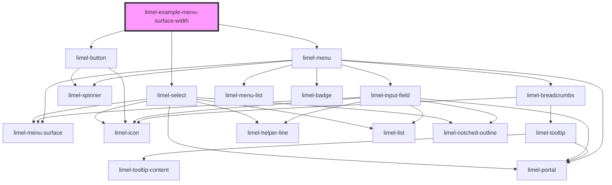

<!-- Auto Generated Below -->

## Overview

Size of the menu drop-down surface

Any element in the UI can be configured to open a menu.
By default, the dropdown that opens up after the menu trigger is clicked
inherits its width from the items that are inside the dropdown menu.

However, for some designs, you may want the width of the menu dropdown
to be exactly as wide as the width of its trigger element, or
as wide as `limel-menu` element itself. This is easily achieved using the
`surfaceWidth` prop. Read more on `SurfaceWidth`.

:::tip
In this example, `limel-menu` is highlighted with a dashed border,
to make it easier to see its width.
:::
:::note
The `--menu-surface-width` Overrides the width defined by `surfaceWidth`!
:::

## Dependencies

### Depends on

- [limel-menu](..)
- [limel-button](../../button)
- [limel-select](../../select)

### Graph

----------------------------------------------

*Built with [StencilJS](https://stenciljs.com/)*
