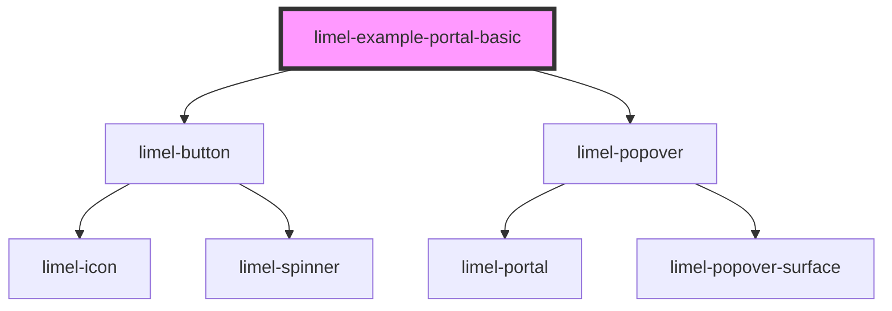

<!-- Auto Generated Below -->

## Overview

Disconnect test

This is an example to test that it works to remove a popover from the DOM,
then add it back again without breaking it

## Dependencies

### Depends on

- [limel-button](../../button)
- [limel-popover](../../popover)

### Graph

----------------------------------------------

*Built with [StencilJS](https://stenciljs.com/)*
