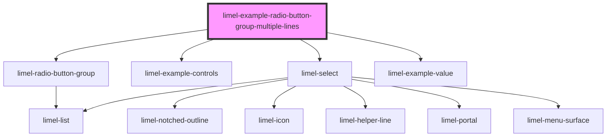

<!-- Auto Generated Below -->

## Overview

With secondary text for items

It is possible to add more descriptive text to each radio button option
using the `secondaryText` property.

You can also use the `maxLinesSecondaryText` prop to control how many lines of
secondary text are displayed before they get truncated.
By default, radio buttons will display 3 lines of secondary text.

## Dependencies

### Depends on

- [limel-radio-button-group](..)
- [limel-example-controls](../../../examples)
- [limel-select](../../select)
- [limel-example-value](../../../examples)

### Graph

----------------------------------------------

*Built with [StencilJS](https://stenciljs.com/)*
