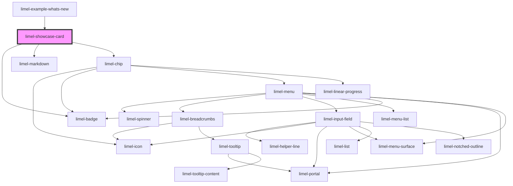

<!-- Auto Generated Below -->

## Overview

This component is used in our library documentation to showcase single component examples.

## Properties

| Property        | Attribute        | Description                                                                                                                     | Type                                   | Default     |
| --------------- | ---------------- | ------------------------------------------------------------------------------------------------------------------------------- | -------------------------------------- | ----------- |
| `componentName` | `component-name` | The name of the component being showcased. The card will generate a link to the component documentation based on this name.     | `string`                               | `undefined` |
| `description`   | `description`    | A short description of the showcased feature                                                                                    | `string`                               | `undefined` |
| `heading`       | `heading`        | The main heading of the card                                                                                                    | `string`                               | `undefined` |
| `releaseDate`   | `release-date`   | The date of the version release                                                                                                 | `string`                               | `undefined` |
| `type`          | `type`           | The type of update being showcased                                                                                              | `"bugfix" \| "component" \| "feature"` | `'feature'` |
| `version`       | `version`        | The version number for the release (e.g. "38.28.0"). The card will prefix it with a leading 'v' and link to the GitHub release. | `string`                               | `undefined` |

## Dependencies

### Used by

 - [limel-example-whats-new](.)

### Depends on

- [limel-badge](../../components/badge)
- [limel-markdown](../../components/markdown)
- [limel-chip](../../components/chip)

### Graph

----------------------------------------------

*Built with [StencilJS](https://stenciljs.com/)*
