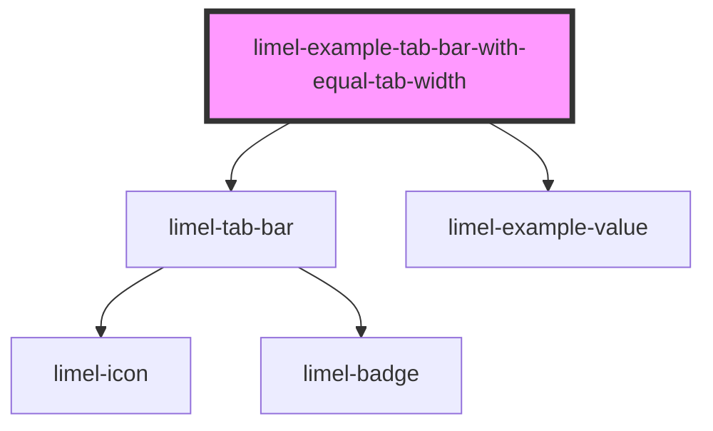

# limel-example-tab-bar-with-equal-tab-width

<!-- Auto Generated Below -->

## Overview

Tab bars with custom styles
In some situations and for the sake of UI design, you may want to have tabs
that equally share the available screen width and stretch. To get such a
result, you can add the `has-tabs-with-equal-width` class to the tab bar.

## Dependencies

### Depends on

- [limel-tab-bar](..)
- [limel-example-value](../../../examples)

### Graph

----------------------------------------------

*Built with [StencilJS](https://stenciljs.com/)*
