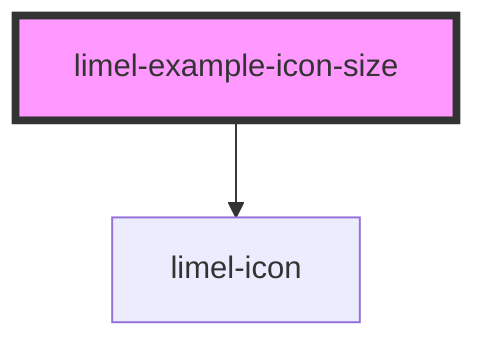

<!-- Auto Generated Below -->

## Overview

Size
There are preset sizes.
:::note
Setting the `bade` prop to `true` affects how big the icon is rendered,
but only when the `size` attribute is also set.
:::

## Dependencies

### Depends on

- [limel-icon](..)

### Graph

----------------------------------------------

*Built with [StencilJS](https://stenciljs.com/)*
