<!-- Auto Generated Below -->

## Overview

:::important
To install your icon set correctly, please read the [documentation here](#/).
:::

The size and color of the icon is normally set in CSS, however there are a few
standard sizes defined that can be used with the `size` property.

## Properties

| Property | Attribute | Description                                                                                                            | Type                                          | Default     |
| -------- | --------- | ---------------------------------------------------------------------------------------------------------------------- | --------------------------------------------- | ----------- |
| `badge`  | `badge`   | Set to `true` to give the icon a round background with some padding. Only works when the `size` attribute is also set. | `boolean`                                     | `undefined` |
| `name`   | `name`    | Name of the icon                                                                                                       | `string`                                      | `undefined` |
| `size`   | `size`    | Size of the icon                                                                                                       | `"large" \| "medium" \| "small" \| "x-small"` | `undefined` |

## Dependencies

### Used by

 - [limel-action-bar](../action-bar)
 - [limel-action-bar-item](../action-bar/action-bar-item)
 - [limel-action-bar-overflow-menu](../action-bar/action-bar-item)
 - [limel-banner](../banner)
 - [limel-breadcrumbs](../breadcrumbs)
 - [limel-button](../button)
 - [limel-button-group](../button-group)
 - [limel-callout](../callout)
 - [limel-card](../card)
 - [limel-chip](../chip)
 - [limel-chip-set](../chip-set)
 - [limel-collapsible-section](../collapsible-section)
 - [limel-dock](../dock)
 - [limel-dock-button](../dock/dock-button)
 - [limel-dynamic-label](../dynamic-label)
 - [limel-example-button-disabled-vs-hidden](../../design-guidelines/disabled-hidden/examples)
 - [limel-example-collapsible-section-actions](../collapsible-section/examples)
 - [limel-example-do-do-not](../../examples)
 - [limel-example-header-menu](../table/examples)
 - [limel-example-icon-color](examples)
 - [limel-example-icon-name](examples)
 - [limel-example-icon-size](examples)
 - [limel-example-select-dialog](../select/examples)
 - [limel-example-shadows-bad-usage](../../design-guidelines/shadows/examples)
 - [limel-example-tab-panel-content](../tab-panel/examples)
 - [limel-example-table-food](../table/examples)
 - [limel-file-dropzone](../file-dropzone)
 - [limel-file-viewer](../file-viewer)
 - [limel-header](../header)
 - [limel-icon-button](../icon-button)
 - [limel-info-tile](../info-tile)
 - [limel-input-field](../input-field)
 - [limel-list-item](../list-item)
 - [limel-profile-picture](../profile-picture)
 - [limel-progress-flow-item](../progress-flow/progress-flow-item)
 - [limel-select](../select)
 - [limel-shortcut](../shortcut)
 - [limel-tab-bar](../tab-bar)

### Graph

```mermaid
graph TD;
  limel-action-bar --> limel-icon
  limel-action-bar-item --> limel-icon
  limel-action-bar-overflow-menu --> limel-icon
  limel-banner --> limel-icon
  limel-breadcrumbs --> limel-icon
  limel-button --> limel-icon
  limel-button-group --> limel-icon
  limel-callout --> limel-icon
  limel-card --> limel-icon
  limel-chip --> limel-icon
  limel-chip-set --> limel-icon
  limel-collapsible-section --> limel-icon
  limel-dock --> limel-icon
  limel-dock-button --> limel-icon
  limel-dynamic-label --> limel-icon
  limel-example-button-disabled-vs-hidden --> limel-icon
  limel-example-collapsible-section-actions --> limel-icon
  limel-example-do-do-not --> limel-icon
  limel-example-header-menu --> limel-icon
  limel-example-icon-color --> limel-icon
  limel-example-icon-name --> limel-icon
  limel-example-icon-size --> limel-icon
  limel-example-select-dialog --> limel-icon
  limel-example-shadows-bad-usage --> limel-icon
  limel-example-tab-panel-content --> limel-icon
  limel-example-table-food --> limel-icon
  limel-file-dropzone --> limel-icon
  limel-file-viewer --> limel-icon
  limel-header --> limel-icon
  limel-icon-button --> limel-icon
  limel-info-tile --> limel-icon
  limel-input-field --> limel-icon
  limel-list-item --> limel-icon
  limel-profile-picture --> limel-icon
  limel-progress-flow-item --> limel-icon
  limel-select --> limel-icon
  limel-shortcut --> limel-icon
  limel-tab-bar --> limel-icon
  style limel-icon fill:#f9f,stroke:#333,stroke-width:4px
```

----------------------------------------------

*Built with [StencilJS](https://stenciljs.com/)*
