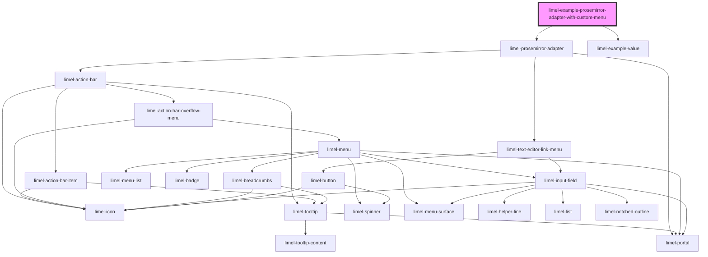

<!-- Auto Generated Below -->

## Overview

Example with custom menu

## Dependencies

### Depends on

- [limel-prosemirror-adapter](..)
- [limel-example-value](../../../../examples)

### Graph

----------------------------------------------

*Built with [StencilJS](https://stenciljs.com/)*
