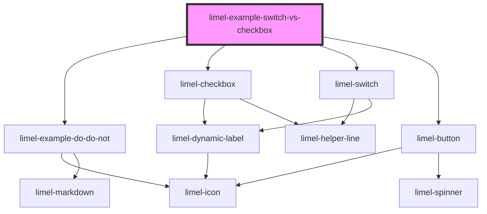

<!-- Auto Generated Below -->

## Dependencies

### Depends on

- [limel-example-do-do-not](../../../examples)
- [limel-checkbox](../../../components/checkbox)
- [limel-switch](../../../components/switch)
- [limel-button](../../../components/button)

### Graph

----------------------------------------------

*Built with [StencilJS](https://stenciljs.com/)*
