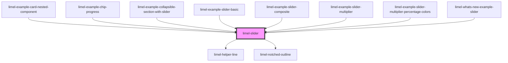

# limel-slider

<!-- Auto Generated Below -->

## Properties

| Property                   | Attribute                    | Description                                                                                                                                                                                                   | Type      | Default             |
| -------------------------- | ---------------------------- | ------------------------------------------------------------------------------------------------------------------------------------------------------------------------------------------------------------- | --------- | ------------------- |
| `disabled`                 | `disabled`                   | Disables the slider when `true`, and visually shows that the field is editable but disabled. This tells the users that if certain requirements are met, the slider may become interactable.                   | `boolean` | `false`             |
| `displaysPercentageColors` | `displays-percentage-colors` | Set to `true` to display percentage-based colors on the slider. The colors change in intervals of 10% as the value changes, creating a color spectrum from red (low) → orange → yellow → green → teal (high). | `boolean` | `false`             |
| `factor`                   | `factor`                     | Default value: 1. The factor that the properties `value`, `valuemax`, `valuemin`, and `step` are multiplied by. On `change` divides the value by the factor, so the original format stays the same.           | `number`  | `DEFAULT_FACTOR`    |
| `helperText`               | `helper-text`                | Optional helper text to display below the slider                                                                                                                                                              | `string`  | `undefined`         |
| `invalid`                  | `invalid`                    | Set to `true` to indicate that the current value of the slider is invalid.                                                                                                                                    | `boolean` | `false`             |
| `label`                    | `label`                      | Label to display next to the input                                                                                                                                                                            | `string`  | `undefined`         |
| `readonly`                 | `readonly`                   | Disables the slider when `true`. This visualizes the slider slightly differently. But shows no visual sign indicating that the slider field is disabled or can ever become interactable.                      | `boolean` | `false`             |
| `required`                 | `required`                   | Set to `true` to indicate that the slider is required.                                                                                                                                                        | `boolean` | `false`             |
| `step`                     | `step`                       | The stepping interval to use when adjusting the value                                                                                                                                                         | `number`  | `undefined`         |
| `unit`                     | `unit`                       | Unit to display next to the value                                                                                                                                                                             | `string`  | `''`                |
| `value`                    | `value`                      | The value of the input                                                                                                                                                                                        | `number`  | `undefined`         |
| `valuemax`                 | `valuemax`                   | The maximum value allowed                                                                                                                                                                                     | `number`  | `DEFAULT_MAX_VALUE` |
| `valuemin`                 | `valuemin`                   | The minimum value allowed                                                                                                                                                                                     | `number`  | `DEFAULT_MIN_VALUE` |

## Events

| Event    | Description                             | Type                  |
| -------- | --------------------------------------- | --------------------- |
| `change` | Emitted when the value has been changed | `CustomEvent<number>` |

## Dependencies

### Used by

 - [limel-example-card-nested-component](../card/examples)
 - [limel-example-chip-progress](../chip/examples)
 - [limel-example-collapsible-section-with-slider](../collapsible-section/examples)
 - [limel-example-slider-basic](examples)
 - [limel-example-slider-composite](examples)
 - [limel-example-slider-multiplier](examples)
 - [limel-example-slider-multiplier-percentage-colors](examples)
 - [limel-whats-new-example-slider](../../examples/whats-new/examples)

### Depends on

- [limel-helper-line](../helper-line)
- [limel-notched-outline](../notched-outline)

### Graph

----------------------------------------------

*Built with [StencilJS](https://stenciljs.com/)*
