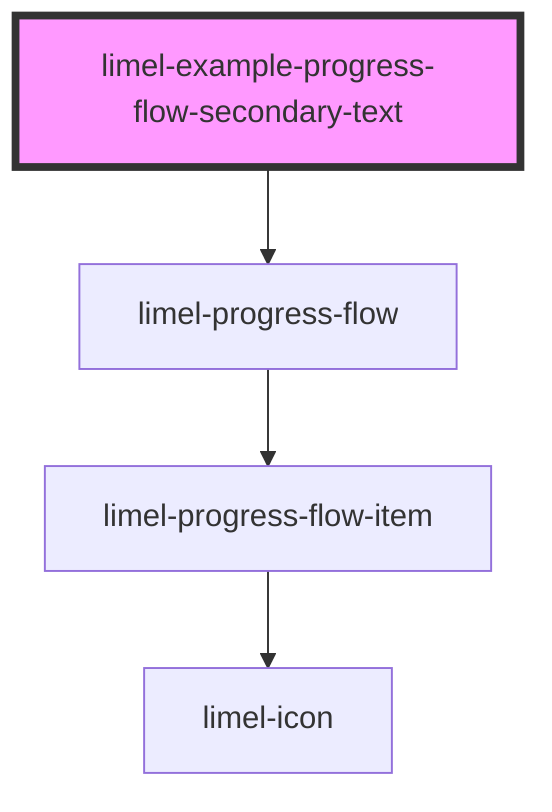

# limel-example-progress-flow-secondary-text

<!-- Auto Generated Below -->

## Overview

Example with secondary text

A `secondaryText` can be used to add further information to steps.
This could be for instance a timestamp of when a step was activated by the user
or an explainatory text.

## Dependencies

### Depends on

- [limel-progress-flow](..)

### Graph

----------------------------------------------

*Built with [StencilJS](https://stenciljs.com/)*
