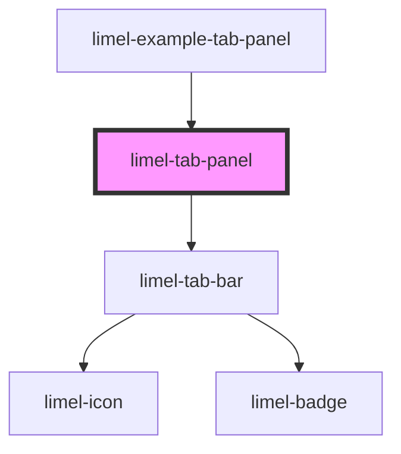

# limel-tab-panel

<!-- Auto Generated Below -->

## Overview

The `limel-tab-panel` component uses the `limel-tab-bar` component together
with custom slotted components and will display the content for the currently
active tab. Each slotted component must have an id equal to the id of the
corresponding tab it belongs to. These components should implement the
[TabPanelComponent](#/type/TabPanelComponent/) interface.

The `limel-tab-panel` component will automatically set each tab configuration
on the corresponding slotted component as a property named `tab` so that the
component can take action upon that. Sometimes it might be desirable to not
load data or render anything until the tab is active.

The slotted components can also emit the `changeTab` event to update anything
inside the actual tab, e.g. to change the icon, color or badge.

## Properties

| Property | Attribute | Description                      | Type    | Default |
| -------- | --------- | -------------------------------- | ------- | ------- |
| `tabs`   | --        | The tabs to display in the panel | `Tab[]` | `[]`    |

## Events

| Event       | Description                         | Type               |
| ----------- | ----------------------------------- | ------------------ |
| `changeTab` | Emitted when a tab has been changed | `CustomEvent<Tab>` |

## Slots

| Slot | Description                                                                                                                              |
| ---- | ---------------------------------------------------------------------------------------------------------------------------------------- |
|      | Content to put inside the `limel-tab-panel`. Each slotted element must have the `id` attribute equal to the id of the tab it belongs to. |

## Dependencies

### Used by

 - [limel-example-tab-panel](examples)

### Depends on

- [limel-tab-bar](../tab-bar)

### Graph

----------------------------------------------

*Built with [StencilJS](https://stenciljs.com/)*
