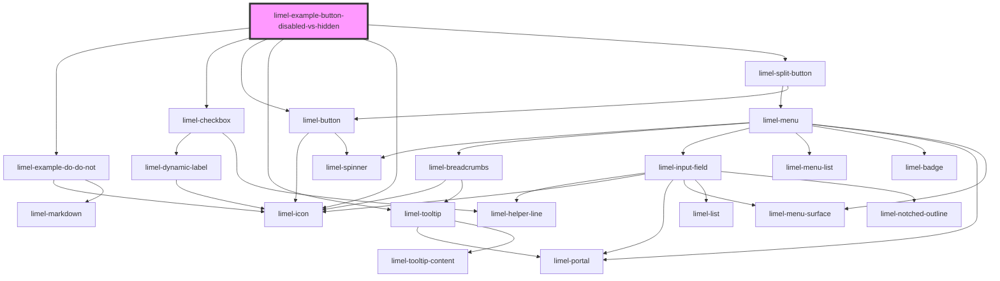

# limel-example-button-disabled-vs-hidden

<!-- Auto Generated Below -->

## Dependencies

### Depends on

- [limel-example-do-do-not](../../../examples)
- [limel-checkbox](../../../components/checkbox)
- [limel-button](../../../components/button)
- [limel-tooltip](../../../components/tooltip)
- [limel-icon](../../../components/icon)
- [limel-split-button](../../../components/split-button)

### Graph

----------------------------------------------

*Built with [StencilJS](https://stenciljs.com/)*
