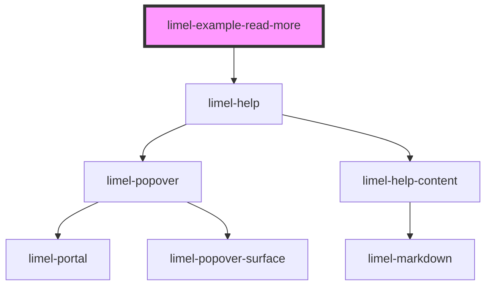

# limel-example-read-more

<!-- Auto Generated Below -->

## Overview

Help with the read more link
If a `readMoreLink` supplied, it will render a "Read more" link at the bottom of the content.

Even though you can add a link anywhere in the content, it is recommended to
use the read more link. Because it will always be displayed at the bottom
of the popover after the content, does not scroll away with the content,
and it will be styled in a consistent way.

## Dependencies

### Depends on

- [limel-help](..)

### Graph

----------------------------------------------

*Built with [StencilJS](https://stenciljs.com/)*
