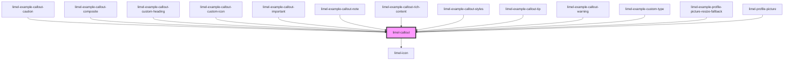

<!-- Auto Generated Below -->

## Overview

Callouts—also known as Admonitions—are useful for including supportive or
special content within a large piece of text, or even inside a user
interface.

When used in a document or text based user interface, the callout attracts
the reader's attention to a particular piece of information, without
significantly interrupting their flow of reading the document.

In a user interface, a callout is more intrusive to the end-user. Still, it
could be a good choice when you intend to slightly disturb the user's
attention, and challenge them to pay extra attention to the information
presented. In such cases, a callout should not be used as a static and
constantly present element of the UI. Rather, it should be displayed when
something unusual or remarkable demands the user's attention.

## Properties

| Property   | Attribute  | Description                                                                                                              | Type                                                                   | Default     |
| ---------- | ---------- | ------------------------------------------------------------------------------------------------------------------------ | ---------------------------------------------------------------------- | ----------- |
| `heading`  | `heading`  | Heading of the callout, which can be used to override the default heading which is displayed based on the chosen `type`. | `string`                                                               | `undefined` |
| `icon`     | `icon`     | Icon of the callout, which can be used to override the default icon which is displayed based on the chosen `type`.       | `string`                                                               | `undefined` |
| `language` | `language` | Defines the language for translations. Will translate the default headings for supported languages.                      | `"da" \| "de" \| "en" \| "fi" \| "fr" \| "nb" \| "nl" \| "no" \| "sv"` | `'en'`      |
| `type`     | `type`     | Defines how the component is visualized, for example which heading, color or icon is used in its user interface.         | `"caution" \| "important" \| "note" \| "tip" \| "warning"`             | `'note'`    |

## Dependencies

### Used by

 - [limel-example-callout-caution](examples)
 - [limel-example-callout-composite](examples)
 - [limel-example-callout-custom-heading](examples)
 - [limel-example-callout-custom-icon](examples)
 - [limel-example-callout-important](examples)
 - [limel-example-callout-note](examples)
 - [limel-example-callout-rich-content](examples)
 - [limel-example-callout-styles](examples)
 - [limel-example-callout-tip](examples)
 - [limel-example-callout-warning](examples)
 - [limel-example-custom-type](examples)
 - [limel-example-profile-picture-resize-fallback](../profile-picture/examples)
 - [limel-profile-picture](../profile-picture)

### Depends on

- [limel-icon](../icon)

### Graph

----------------------------------------------

*Built with [StencilJS](https://stenciljs.com/)*
