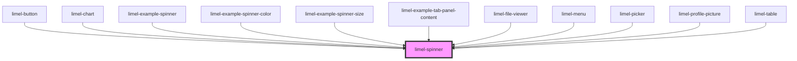

<!-- Auto Generated Below -->

## Properties

| Property      | Attribute      | Description                                            | Type                                                    | Default  |
| ------------- | -------------- | ------------------------------------------------------ | ------------------------------------------------------- | -------- |
| `limeBranded` | `lime-branded` | Gives the spinner the shape of Lime Technologies' logo | `boolean`                                               | `false`  |
| `size`        | `size`         | Determines the size of the spinner.                    | `"large" \| "medium" \| "mini" \| "small" \| "x-small"` | `'mini'` |

## Dependencies

### Used by

 - [limel-button](../button)
 - [limel-chart](../chart)
 - [limel-example-spinner](examples)
 - [limel-example-spinner-color](examples)
 - [limel-example-spinner-size](examples)
 - [limel-example-tab-panel-content](../tab-panel/examples)
 - [limel-file-viewer](../file-viewer)
 - [limel-menu](../menu)
 - [limel-picker](../picker)
 - [limel-profile-picture](../profile-picture)
 - [limel-table](../table)

### Graph

----------------------------------------------

*Built with [StencilJS](https://stenciljs.com/)*
