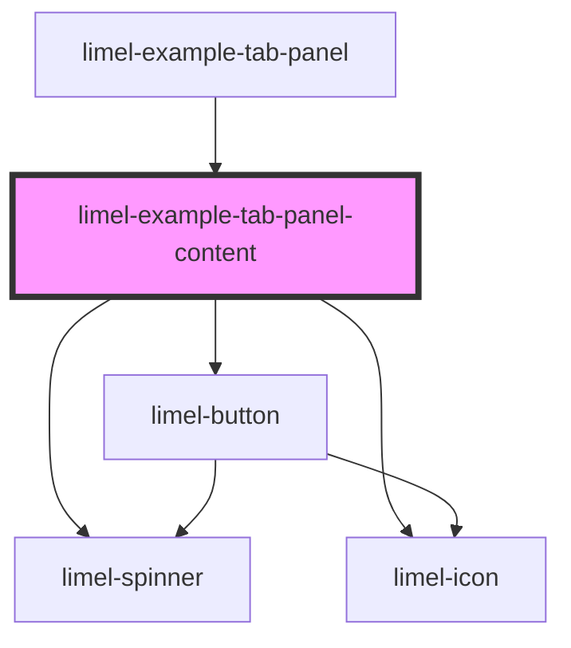

<!-- Auto Generated Below -->

## Properties

| Property | Attribute | Description                            | Type  | Default     |
| -------- | --------- | -------------------------------------- | ----- | ----------- |
| `tab`    | --        | The tab that this component belongs to | `Tab` | `undefined` |

## Events

| Event       | Description                                                            | Type               |
| ----------- | ---------------------------------------------------------------------- | ------------------ |
| `changeTab` | Emitted when the vote button is clicked to update the badge in the tab | `CustomEvent<Tab>` |

## Dependencies

### Used by

 - [limel-example-tab-panel](.)

### Depends on

- [limel-spinner](../../spinner)
- [limel-icon](../../icon)
- [limel-button](../../button)

### Graph

----------------------------------------------

*Built with [StencilJS](https://stenciljs.com/)*
