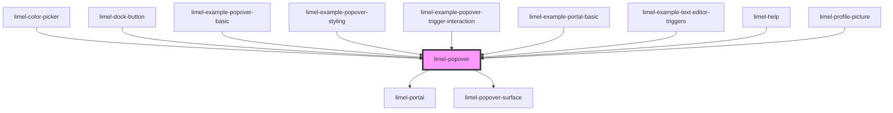

<!-- Auto Generated Below -->

## Overview

A popover is an impermanent layer that is displayed on top of other content
when user taps an element that triggers the popover. This element can be
practically anything, a button, piece of text, and icon, etc.

Popovers are nonmodal, thus they don't have a semi-transparent backdrop layer
that darkens the content below them. Also for the same reason, they can be
dismissed by tapping or clicking another part of the screen, but not by a
clicking a button or link on the popover itself.

## Usage
Use a popover to show **options** or **information** related to the trigger
onscreen. A typical use case for popovers is a tooltip, in which you show
help text or contextual information to users.

Popovers are most appropriate on larger screens but can be used on smaller
screens too, as long as their content is responsive and takes into account
the context they are displayed on.

When a popover is displayed, interactions with other controls are blocked,
until user dismisses the popover.

## Layout
Popovers has only one slot in which you can import a custom web-component.

:::note
You must make sure that web-components that you import into the slot has
a `width: 100%;` style so that it can horizontally stretch across the popover.

However, `width` of the popover can be controlled by specifying a CSS variable
of `--popover-surface-width`. If you don't specify any width, the popover
will grow as wide as its content.
:::

:::important
Do not make a popover too big. They should never take over the entire screen.
If your content is that big, you should probably be using a Modal instead.
:::

## Properties

| Property        | Attribute        | Description                                               | Type                                                                                                                                                                 | Default     |
| --------------- | ---------------- | --------------------------------------------------------- | -------------------------------------------------------------------------------------------------------------------------------------------------------------------- | ----------- |
| `open`          | `open`           | True if the content within the popover should be visible  | `boolean`                                                                                                                                                            | `false`     |
| `openDirection` | `open-direction` | Decides the popover's location in relation to its trigger | `"bottom" \| "bottom-end" \| "bottom-start" \| "left" \| "left-end" \| "left-start" \| "right" \| "right-end" \| "right-start" \| "top" \| "top-end" \| "top-start"` | `undefined` |

## Events

| Event   | Description                                  | Type                |
| ------- | -------------------------------------------- | ------------------- |
| `close` | Emits an event when the component is closing | `CustomEvent<void>` |

## Slots

| Slot | Description                       |
| ---- | --------------------------------- |
|      | Content to put inside the surface |

## Dependencies

### Used by

 - [limel-color-picker](../color-picker)
 - [limel-dock-button](../dock/dock-button)
 - [limel-example-popover-basic](examples)
 - [limel-example-popover-styling](examples)
 - [limel-example-popover-trigger-interaction](examples)
 - [limel-example-portal-basic](../portal/examples)
 - [limel-example-text-editor-triggers](../text-editor/examples)
 - [limel-help](../help)
 - [limel-profile-picture](../profile-picture)

### Depends on

- [limel-portal](../portal)
- [limel-popover-surface](../popover-surface)

### Graph

----------------------------------------------

*Built with [StencilJS](https://stenciljs.com/)*
