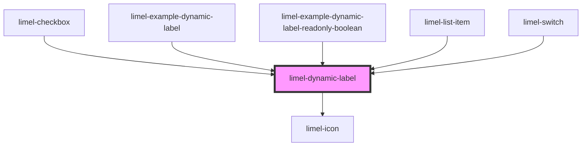

<!-- Auto Generated Below -->

## Overview

This components displays a different label depending on the current given
value. A label can consist of a text and an optional icon. If no matching
label is found among the given `labels`, the `defaultLabel` will be displayed.

One use case of the component is to enhance the visualization of a `boolean`
field like a checkbox or switch in a `readonly` state.

The reason we offer this component is that the default styling
of the Checkbox or Toggle switch in the `readonly` state may not always
provide the best way of _visualizing information_, potentially leading to
confusion and negatively affecting the end-users' experience.

## Properties

| Property       | Attribute | Description                                                                                                                                                                             | Type                           | Default     |
| -------------- | --------- | --------------------------------------------------------------------------------------------------------------------------------------------------------------------------------------- | ------------------------------ | ----------- |
| `defaultLabel` | --        | The label to display when no matching value is found in the `labels` array. This is a fallback label that ensures there's always a label displayed for the component.                   | `"value" \| Label<LabelValue>` | `{}`        |
| `labels`       | --        | A list of available labels. Each label has a corresponding value that will be matched with the current `value` of the component to determine what label to display.                     | `Label<LabelValue>[]`          | `[]`        |
| `value`        | `value`   | The current value of the component which is used to match with the given `labels` to determine what label to display.  If not matching label is found, the `defaultLabel` is displayed. | `boolean \| number \| string`  | `undefined` |

## Dependencies

### Used by

 - [limel-checkbox](../checkbox)
 - [limel-example-dynamic-label](examples)
 - [limel-example-dynamic-label-readonly-boolean](examples)
 - [limel-list-item](../list-item)
 - [limel-switch](../switch)

### Depends on

- [limel-icon](../icon)

### Graph

----------------------------------------------

*Built with [StencilJS](https://stenciljs.com/)*
