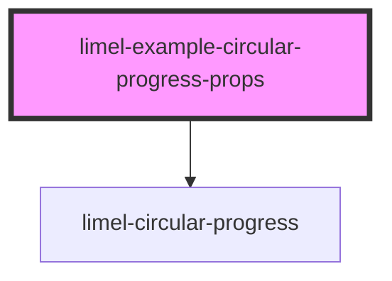

<!-- Auto Generated Below -->

## Overview

Using the props
This component is initially designed to visualize a percentage on a scale of
zero to 100. However, you can easily visualize a progress in other scales,
simply by setting `maxValue`, `prefix` and `suffix`.

Look at this example to see how the component displays an angle in a
360-degrees scale, a 60-seconds scale, and a 5-stars rating.

## Dependencies

### Depends on

- [limel-circular-progress](..)

### Graph

----------------------------------------------

*Built with [StencilJS](https://stenciljs.com/)*
