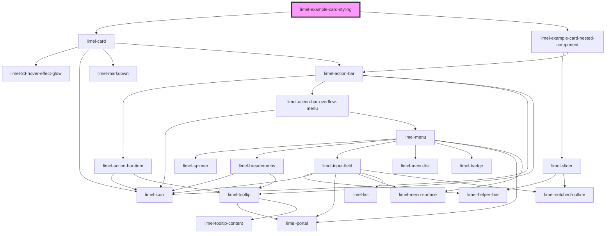

<!-- Auto Generated Below -->

## Overview

Styling
The component offers a few styling options in form of custom CSS variables,
to make it fit better in different contexts.

## Dependencies

### Depends on

- [limel-card](..)
- [limel-example-card-nested-component](.)

### Graph

----------------------------------------------

*Built with [StencilJS](https://stenciljs.com/)*
