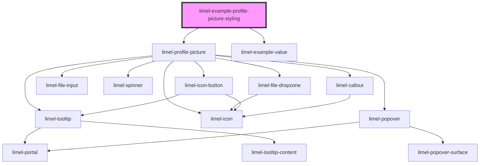

<!-- Auto Generated Below -->

## Overview

Styling

Even though the component's main use case is displaying a profile picture—in
which a file input, an image viewer, and other controls are combined within
the same component—it can also be styled to fit different design requirements.

Custom CSS property `--profile-picture-border-radius` can be used to customize
the appearance of the component. Additionally, you can define a custom size or
aspect ratio to render the image as desired.

## Dependencies

### Depends on

- [limel-profile-picture](..)
- [limel-example-value](../../../examples)

### Graph

----------------------------------------------

*Built with [StencilJS](https://stenciljs.com/)*
