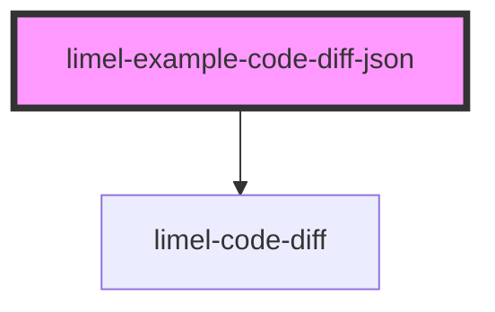

<!-- Auto Generated Below -->

## Overview

JSON object diff

When comparing objects, the component serializes them to
pretty-printed JSON with sorted keys before diffing.
Set `reformatJson` to normalize formatting and key order,
eliminating noise from trivial differences.

This is ideal for comparing configuration objects where
an admin may have changed values.

## Dependencies

### Depends on

- [limel-code-diff](..)

### Graph

----------------------------------------------

*Built with [StencilJS](https://stenciljs.com/)*
