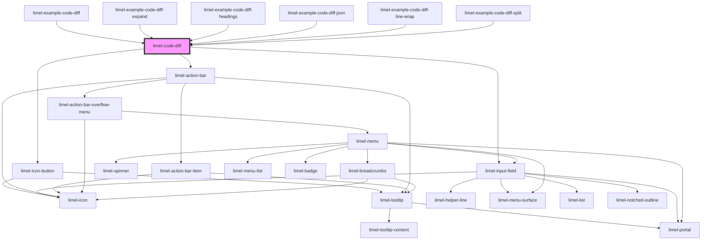

<!-- Auto Generated Below -->

## Overview

Displays a visual diff between two text values, modeled on
GitHub's code difference view.

Supports unified and split (side-by-side) views with line numbers,
color-coded additions and removals, word-level inline highlighting,
and collapsible unchanged context sections.

## Properties

| Property              | Attribute              | Description                                                                                                                                                         | Type                                                                   | Default     |
| --------------------- | ---------------------- | ------------------------------------------------------------------------------------------------------------------------------------------------------------------- | ---------------------------------------------------------------------- | ----------- |
| `colorScheme`         | `color-scheme`         | Select color scheme for the diff viewer.                                                                                                                            | `"auto" \| "dark" \| "light"`                                          | `'auto'`    |
| `contextLines`        | `context-lines`        | Number of unchanged context lines to display around each change.                                                                                                    | `number`                                                               | `3`         |
| `language`            | `language`             | Language for syntax highlighting. Currently supports `"json"`. When set, code tokens are colorized (strings, numbers, keys, etc.) alongside the diff highlighting.  | `string`                                                               | `undefined` |
| `layout`              | `layout`               | The layout of the diff view. - `unified` — single column with interleaved additions and removals - `split` — side-by-side comparison with old on left, new on right | `"split" \| "unified"`                                                 | `'unified'` |
| `lineWrapping`        | `line-wrapping`        | When `true`, long lines are wrapped instead of causing horizontal scrolling. Useful when comparing prose or config files with long values.                          | `boolean`                                                              | `false`     |
| `newHeading`          | `new-heading`          | Heading for the modified (after) version, displayed in the diff header. Defaults to `"Modified"`, localized via `translationLanguage`.                              | `string`                                                               | `undefined` |
| `newValue`            | `new-value`            | The "after" value to compare. Can be a string or an object (which will be serialized to JSON).                                                                      | `object \| string`                                                     | `''`        |
| `oldHeading`          | `old-heading`          | Heading for the original (before) version, displayed in the diff header. Defaults to `"Original"`, localized via `translationLanguage`.                             | `string`                                                               | `undefined` |
| `oldValue`            | `old-value`            | The "before" value to compare. Can be a string or an object (which will be serialized to JSON).                                                                     | `object \| string`                                                     | `''`        |
| `reformatJson`        | `reformat-json`        | When `true`, JSON values are parsed, keys are sorted, and indentation is normalized before diffing. This eliminates noise from formatting or key-order differences. | `boolean`                                                              | `false`     |
| `translationLanguage` | `translation-language` | Defines the language for translations. Will translate all visible labels and announcements.                                                                         | `"da" \| "de" \| "en" \| "fi" \| "fr" \| "nb" \| "nl" \| "no" \| "sv"` | `'en'`      |

## Dependencies

### Used by

 - [limel-example-code-diff](examples)
 - [limel-example-code-diff-expand](examples)
 - [limel-example-code-diff-headings](examples)
 - [limel-example-code-diff-json](examples)
 - [limel-example-code-diff-line-wrap](examples)
 - [limel-example-code-diff-split](examples)

### Depends on

- [limel-icon-button](../icon-button)
- [limel-input-field](../input-field)
- [limel-action-bar](../action-bar)

### Graph

----------------------------------------------

*Built with [StencilJS](https://stenciljs.com/)*
