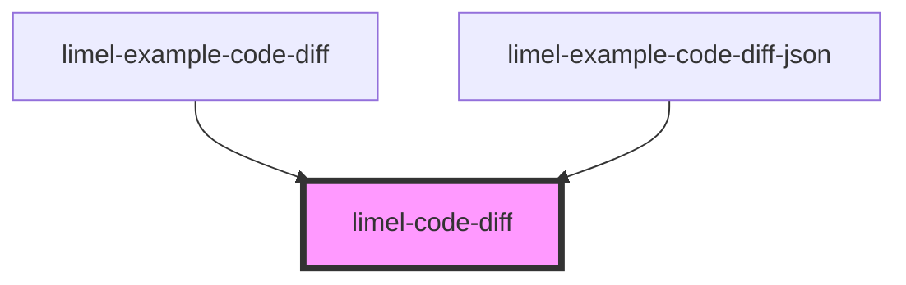

<!-- Auto Generated Below -->

## Overview

Displays a visual diff between two text values, modeled on
GitHub's code difference view.

Supports unified view with line numbers, color-coded additions
and removals, word-level inline highlighting, and collapsible
unchanged context sections.

## Properties

| Property       | Attribute       | Description                                                                                                                                                         | Type                          | Default     |
| -------------- | --------------- | ------------------------------------------------------------------------------------------------------------------------------------------------------------------- | ----------------------------- | ----------- |
| `colorScheme`  | `color-scheme`  | Select color scheme for the diff viewer.                                                                                                                            | `"auto" \| "dark" \| "light"` | `'auto'`    |
| `contextLines` | `context-lines` | Number of unchanged context lines to display around each change.                                                                                                    | `number`                      | `3`         |
| `newHeader`    | `new-header`    | Label for the new (after) version, displayed in the diff header.                                                                                                    | `string`                      | `undefined` |
| `newValue`     | `new-value`     | The "after" value to compare. Can be a string or an object (which will be serialized to JSON).                                                                      | `object \| string`            | `''`        |
| `oldHeader`    | `old-header`    | Label for the old (before) version, displayed in the diff header.                                                                                                   | `string`                      | `undefined` |
| `oldValue`     | `old-value`     | The "before" value to compare. Can be a string or an object (which will be serialized to JSON).                                                                     | `object \| string`            | `''`        |
| `reformatJson` | `reformat-json` | When `true`, JSON values are parsed, keys are sorted, and indentation is normalized before diffing. This eliminates noise from formatting or key-order differences. | `boolean`                     | `false`     |
| `viewMode`     | `view-mode`     | The diff view mode. Currently only `unified` is supported.                                                                                                          | `"split" \| "unified"`        | `'unified'` |

## Dependencies

### Used by

 - [limel-example-code-diff](examples)
 - [limel-example-code-diff-json](examples)

### Graph

----------------------------------------------

*Built with [StencilJS](https://stenciljs.com/)*
