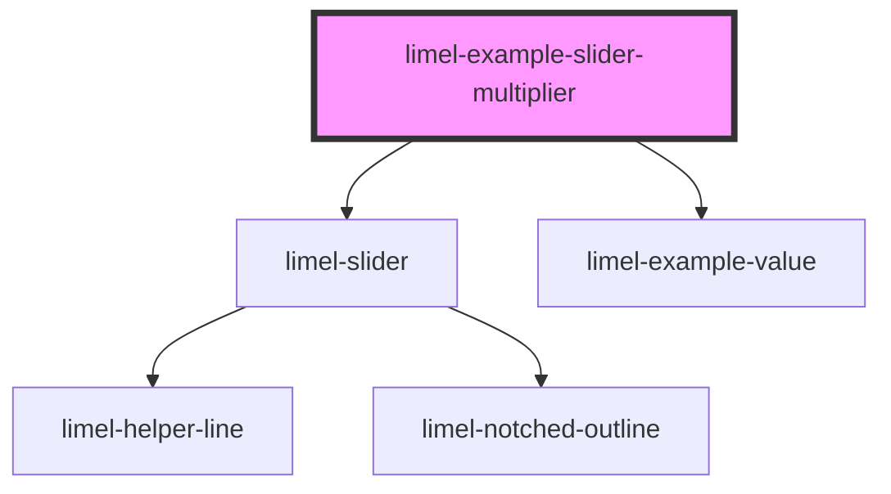

<!-- Auto Generated Below -->

## Overview

With multiplier and step

When step is configured and the initial value is not a multiple of the step
value, the slider will round the value to the nearest step when it is changed
for the first time. After a valid value has been set, only discrete valid
values will be possible to pick.

## Dependencies

### Depends on

- [limel-slider](..)
- [limel-example-value](../../../examples)

### Graph

----------------------------------------------

*Built with [StencilJS](https://stenciljs.com/)*
