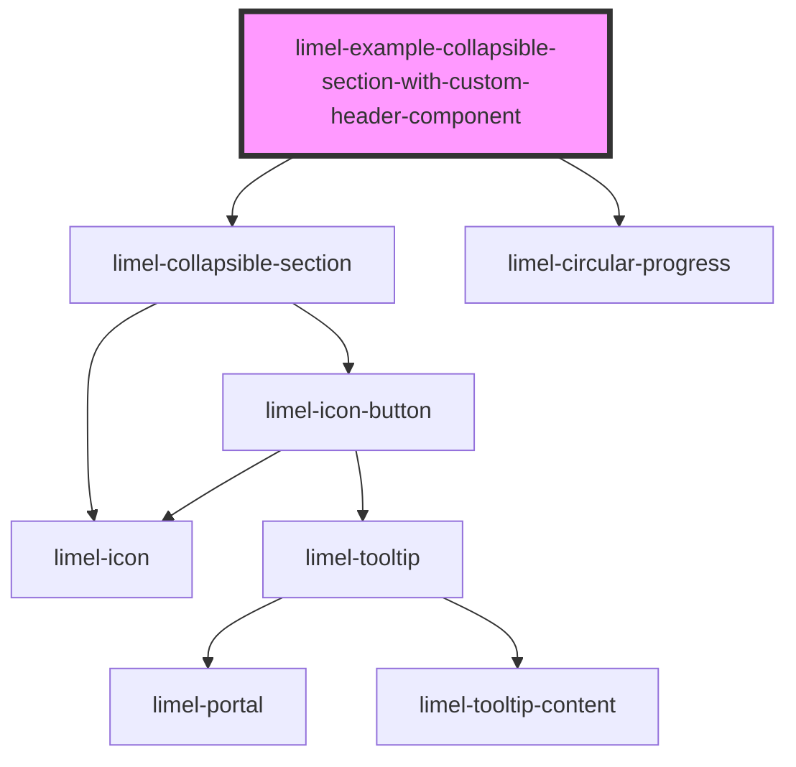

<!-- Auto Generated Below -->

## Overview

With custom component in the header
By using the `slot="header"` attribute on a custom UI elements, you can place it
in the header area of the collapsible section alongside the default header text
and header actions.
This can enable richer header content, like status indicators, badges, or icons.

:::important
1. The custom component is responsible for its own size, and should not
visually grow out of the header area.
1. If the is not interactive, we recommend styling it with `pointer-events: none;`,
to avoid blocking the user from interacting with the header. This is because
the entire surface of the header should be clickable to toggle visibility of the section.
:::

## Dependencies

### Depends on

- [limel-collapsible-section](..)
- [limel-circular-progress](../../circular-progress)

### Graph

----------------------------------------------

*Built with [StencilJS](https://stenciljs.com/)*
