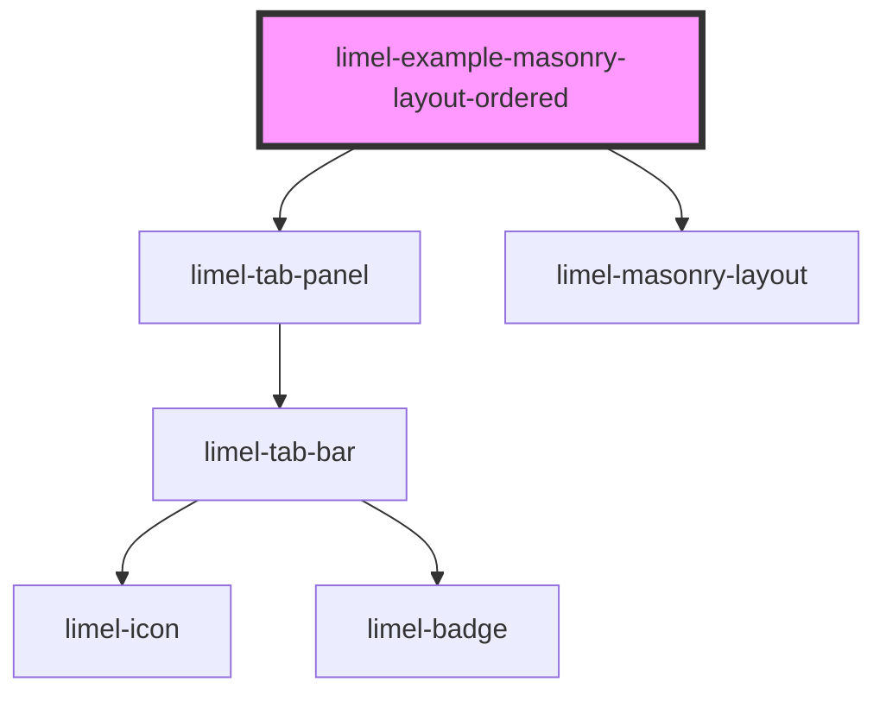

<!-- Auto Generated Below -->

## Overview

Ordered layout

By default, items are placed in the shortest column to
optimize space usage. This means the visual order may not
match the DOM order.

Setting `ordered` to `true` places items left-to-right in
DOM order (round-robin across columns), preserving the reading
order. The trade-off is that column heights may become uneven
if tall items happen to cluster in the same column.

:::tip
Use `ordered` when the sequence of items matters,
such as numbered lists or timelines.
Use the default when visual balance is more important,
such as photo galleries or dashboards.
:::

## Dependencies

### Depends on

- [limel-tab-panel](../../tab-panel)
- [limel-masonry-layout](..)

### Graph

----------------------------------------------

*Built with [StencilJS](https://stenciljs.com/)*
