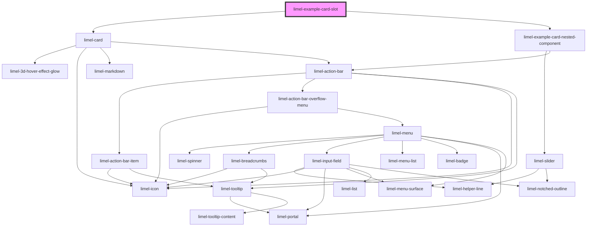

<!-- Auto Generated Below -->

## Overview

Nesting a component in the card
You can nest any component inside the card, to provide a more complex
and interactive experience to the user.

## Dependencies

### Depends on

- [limel-card](..)
- [limel-example-card-nested-component](.)

### Graph

----------------------------------------------

*Built with [StencilJS](https://stenciljs.com/)*
