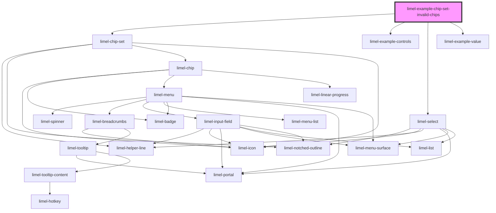

<!-- Auto Generated Below -->

## Overview

Per-chip invalid state

Set `invalid: true` on any chip in the `value` array to mark that
specific chip as invalid. This is independent of the chip-set-level
`invalid` prop, which is intended for signalling that the whole field
is invalid. Per-chip `invalid` lets the consumer flag individual
entries, for example an address that fails validation in a list of
recipients.

In this example, each entry is checked with a simple email regex when
added. Invalid entries are rendered with `invalid: true` and an error
icon.

## Dependencies

### Depends on

- [limel-chip-set](..)
- [limel-example-controls](../../../examples)
- [limel-select](../../select)
- [limel-example-value](../../../examples)

### Graph

----------------------------------------------

*Built with [StencilJS](https://stenciljs.com/)*
