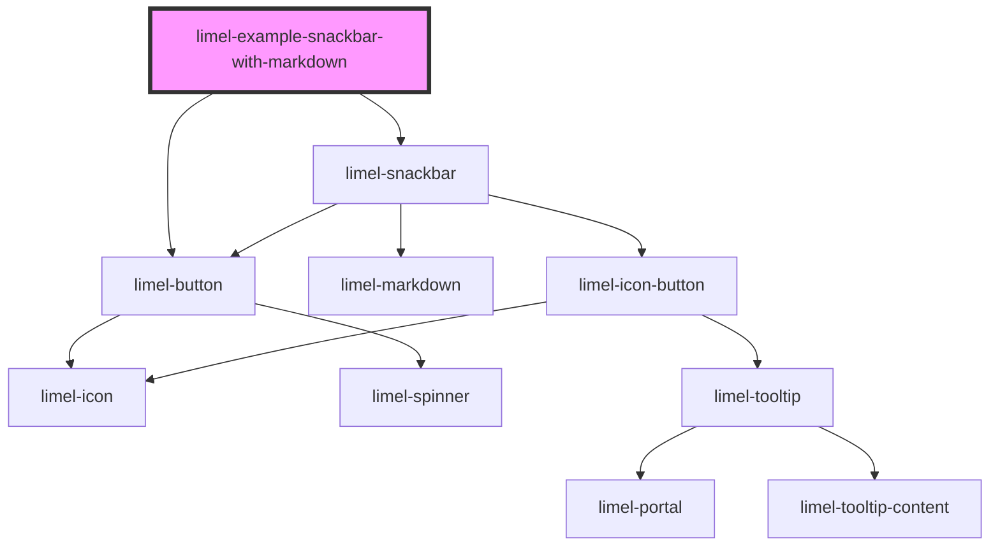

<!-- Auto Generated Below -->

## Overview

Markdown formatting

The `message` property supports [Markdown](#/component/limel-markdown/)
syntax. This lets you lightly emphasize a single word with `**bold**`
or `*italic*` so the reader can scan the feedback more quickly.

In this example, the entity name *"Westeros Ltd."* is rendered in bold
to make it easy to tell apart from the rest of the sentence.

:::important
Keep the feedback short and brief. A snackbar is a quick, ignorable
nudge — not a place for rich content. Avoid complex Markdown such as
headings, lists, tables, images, blockquotes, or long links. These
push content off screen, add visual noise, and undermine the
snackbar's purpose.

If you need more than a single sentence, or the information is
important enough to require the user's attention, reach for a
[Banner](#/component/limel-banner/) or
[Dialog](#/component/limel-dialog/) instead.
:::

## Dependencies

### Depends on

- [limel-button](../../button)
- [limel-snackbar](..)

### Graph

----------------------------------------------

*Built with [StencilJS](https://stenciljs.com/)*
