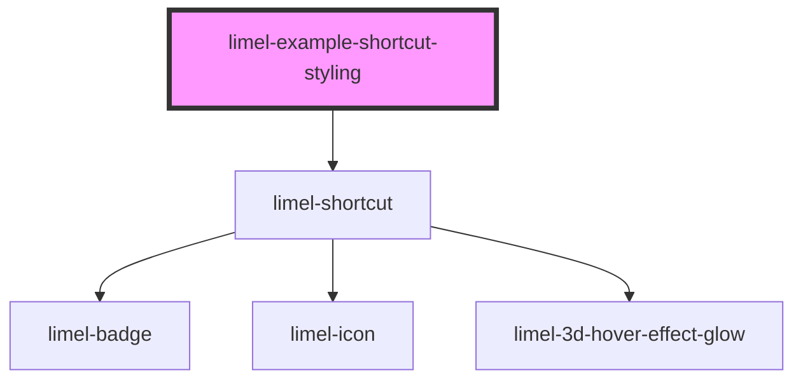

<!-- Auto Generated Below -->

## Overview

How to style the shortcut

The component offers different CSS variables for styling
the color of the shortcut, and it's icon; as well as
radius of it's rounded corners, and colors of the notification badge
and its text.

## Dependencies

### Depends on

- [limel-shortcut](..)

### Graph

----------------------------------------------

*Built with [StencilJS](https://stenciljs.com/)*
