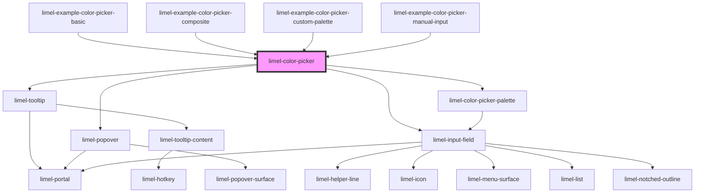

<!-- Auto Generated Below -->

## Overview

This component enables you to select a swatch from out color palette, simply
by clicking on it. You can then copy the css variable name of the chosen color
and use it where desired.

The color picker can also show you a preview of any valid color name or color value.

:::note
Make sure to read our [guidelines about usage of colors](#/DesignGuidelines/color-system.md/) from our palette.
:::

## Properties

| Property             | Attribute              | Description                                                                                                                                                                                                                             | Type                              | Default     |
| -------------------- | ---------------------- | --------------------------------------------------------------------------------------------------------------------------------------------------------------------------------------------------------------------------------------- | --------------------------------- | ----------- |
| `disabled`           | `disabled`             | Set to `true` to disable the field. Use `disabled` to indicate that the field can normally be interacted with, but is currently disabled. This tells the user that if certain requirements are met, the field may become enabled again. | `boolean`                         | `false`     |
| `helperText`         | `helper-text`          | Helper text of the input field                                                                                                                                                                                                          | `string`                          | `undefined` |
| `invalid`            | `invalid`              | Set to `true` to indicate that the current value of the input field is invalid.                                                                                                                                                         | `boolean`                         | `false`     |
| `label`              | `label`                | The label of the input field                                                                                                                                                                                                            | `string`                          | `undefined` |
| `manualInput`        | `manual-input`         | Set to `false` to disallow custom color values to be typed into the input field. Setting this to `false` does not completely disable the color picker. It will only allow users to pick from the provided color palette.                | `boolean`                         | `true`      |
| `palette`            | --                     | An array of either color value strings, or objects with a `name` and a `value`, which replaces the default palette. Any valid CSS color format is accepted as value (HEX, RGB/A, HSL, HWB, color-mix(), named colors, etc.).            | `(string \| CustomColorSwatch)[]` | `undefined` |
| `paletteColumnCount` | `palette-column-count` | Defines the number of columns in the color swatch grid. If not provided, it will default to the number of colors in the palette; but stops at a maximum of 25 columns.                                                                  | `number`                          | `undefined` |
| `placeholder`        | `placeholder`          | The placeholder text shown inside the input field, when the field is focused and empty.                                                                                                                                                 | `string`                          | `undefined` |
| `readonly`           | `readonly`             | Set to `true` to make the field read-only. Use `readonly` when the field is only there to present the data it holds, and will not become possible for the current user to edit.                                                         | `boolean`                         | `false`     |
| `required`           | `required`             | Set to `true` if a value is required                                                                                                                                                                                                    | `boolean`                         | `undefined` |
| `tooltipLabel`       | `tooltip-label`        | Displayed as tooltips when picker is hovered.                                                                                                                                                                                           | `string`                          | `undefined` |
| `value`              | `value`                | Name or code of the chosen color                                                                                                                                                                                                        | `string`                          | `undefined` |

## Events

| Event    | Description                                | Type                  |
| -------- | ------------------------------------------ | --------------------- |
| `change` | Emits chosen value to the parent component | `CustomEvent<string>` |

## Dependencies

### Used by

 - [limel-example-color-picker-basic](examples)
 - [limel-example-color-picker-composite](examples)
 - [limel-example-color-picker-custom-palette](examples)
 - [limel-example-color-picker-manual-input](examples)

### Depends on

- [limel-tooltip](../tooltip)
- [limel-popover](../popover)
- [limel-color-picker-palette](.)
- [limel-input-field](../input-field)

### Graph

----------------------------------------------

*Built with [StencilJS](https://stenciljs.com/)*
