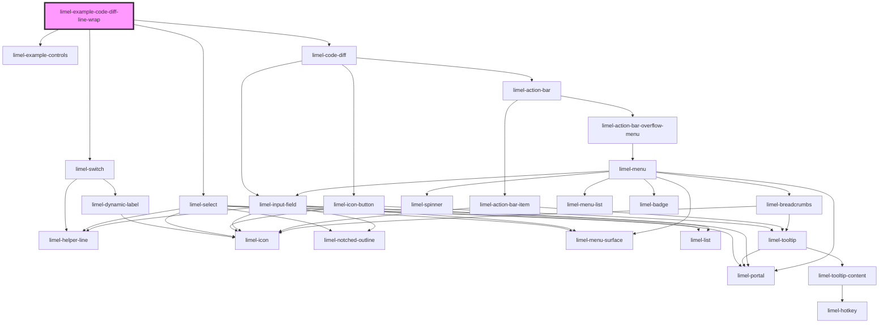

<!-- Auto Generated Below -->

## Overview

Line wrapping

Set `lineWrapping` to `true` to wrap long lines instead of scrolling
horizontally. This is useful for config files, prose, or any content
with long values.

Toggle the split view to see how wrapping behaves in each mode.

## Dependencies

### Depends on

- [limel-example-controls](../../../examples)
- [limel-switch](../../switch)
- [limel-select](../../select)
- [limel-code-diff](..)

### Graph

----------------------------------------------

*Built with [StencilJS](https://stenciljs.com/)*
