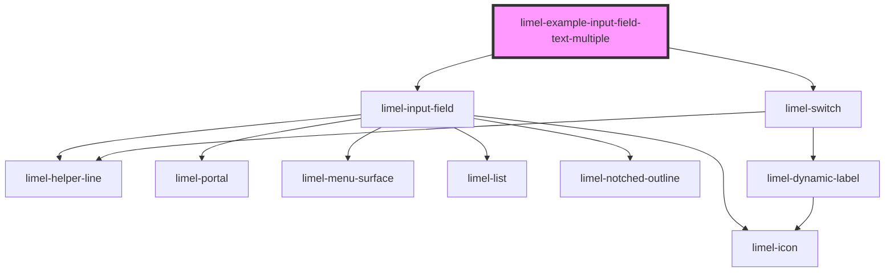

<!-- Auto Generated Below -->

## Overview

Multiple Fields

## Dependencies

### Depends on

- [limel-input-field](..)
- [limel-switch](../../switch)

### Graph

----------------------------------------------

*Built with [StencilJS](https://stenciljs.com/)*
