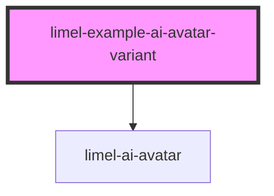

<!-- Auto Generated Below -->

## Overview

Variants

The `variant` property selects the avatar's visual style. The `detailed`
variant is the fully detailed orb with reflections and shines; the
`minimalistic` variant is a simplified design with a single gradient orb,
a stroked outline, and a soft halo.

Eye and mouth shapes — and all the animations driving them (blink,
look-around, etc.) — are shared across variants, so switching `variant`
changes the body but not the personality.

## Dependencies

### Depends on

- [limel-ai-avatar](..)

### Graph

----------------------------------------------

*Built with [StencilJS](https://stenciljs.com/)*
