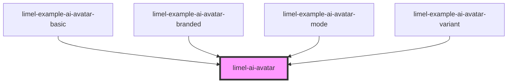

<!-- Auto Generated Below -->

## Overview

This component displays an avatar, representing Lime AI assistants.

:::warning
This is a private component used internally in the Lime's various applications,
which is the reason for having it in Lime Elements —to ease the distribution
of the component across all our apps.

3rd party developers are not allowed use this component directly.
:::

## Properties

| Property     | Attribute     | Description                                                                                                                                                                                                                                                                               | Type                                                                     | Default                                      |
| ------------ | ------------- | ----------------------------------------------------------------------------------------------------------------------------------------------------------------------------------------------------------------------------------------------------------------------------------------- | ------------------------------------------------------------------------ | -------------------------------------------- |
| `isThinking` | `is-thinking` | **[DEPRECATED]** Setting this property no longer has any effect. Use the `mode` property with the value `thinking` instead. This property will be removed in a future major version.                                                               | `boolean`                                                                | `false`                                      |
| `language`   | `language`    | Defines the language for translations.                                                                                                                                                                                                                                                    | `"da" \| "de" \| "en" \| "fi" \| "fr" \| "nb" \| "nl" \| "no" \| "sv"`   | `document.documentElement.lang as Languages` |
| `mode`       | `mode`        | Represents the current activity of the AI agent. The avatar uses this to drive its visual state and animations. Defaults to `idle`.                                                                                                                                                       | `"active" \| "idle" \| "thinking" \| "typing" \| "waiting" \| "working"` | `'idle'`                                     |
| `variant`    | `variant`     | Selects the avatar's visual style. The `detailed` variant is the fully detailed orb; the `minimalistic` variant is a simplified design with a single gradient orb, a stroked outline, and a soft halo. Eye and mouth shapes (and all animations driving them) are shared across variants. | `"detailed" \| "minimalistic"`                                           | `'detailed'`                                 |

## Dependencies

### Used by

 - [limel-example-ai-avatar-basic](examples)
 - [limel-example-ai-avatar-branded](examples)
 - [limel-example-ai-avatar-mode](examples)
 - [limel-example-ai-avatar-variant](examples)

### Graph

----------------------------------------------

*Built with [StencilJS](https://stenciljs.com/)*
