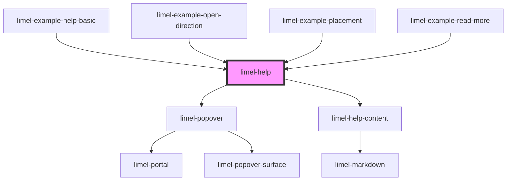

<!-- Auto Generated Below -->

## Overview

A good design is self-explanatory! However, sometimes concepts are
too complex to understand, no matter how well-designed a user interface is.
In such cases, contextual help can be a great way to provide users with
help precisely where and when users need it.

In app interface design, providing contextual help emerges as a viable practice
for enhancing user experience and usability.
Contextual help serves as a quick-to-access guiding,
empowering users to more easily understand and navigate through
the intricacies of an application.

Using this component designers empower users to grasp the functionality
of an app more effortlessly, minimizes the learning curve,
transforming complex features into accessible opportunities for exploration.

## Properties

| Property        | Attribute        | Description                      | Type                                                                                                                                                                 | Default       |
| --------------- | ---------------- | -------------------------------- | -------------------------------------------------------------------------------------------------------------------------------------------------------------------- | ------------- |
| `openDirection` | `open-direction` | {@inheritdoc Help.openDirection} | `"bottom" \| "bottom-end" \| "bottom-start" \| "left" \| "left-end" \| "left-start" \| "right" \| "right-end" \| "right-start" \| "top" \| "top-end" \| "top-start"` | `'top-start'` |
| `readMoreLink`  | --               | {@inheritdoc Help.readMoreLink}  | `Link`                                                                                                                                                               | `undefined`   |
| `trigger`       | `trigger`        | {@inheritdoc Help.trigger}       | `string`                                                                                                                                                             | `'?'`         |
| `value`         | `value`          | {@inheritdoc Help.value}         | `string`                                                                                                                                                             | `undefined`   |

## Dependencies

### Used by

 - [limel-example-help-basic](examples)
 - [limel-example-open-direction](examples)
 - [limel-example-placement](examples)
 - [limel-example-read-more](examples)

### Depends on

- [limel-popover](../popover)
- [limel-help-content](.)

### Graph

----------------------------------------------

*Built with [StencilJS](https://stenciljs.com/)*
