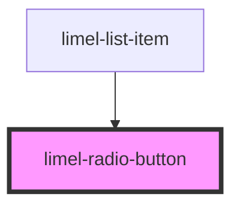

<!-- Auto Generated Below -->

## Overview

This is a low-level private component that renders individual radio button elements.
It's used internally by the list-item component to render radio buttons when
`type="radio"` is specified.

## Usage in the Library

This template is primarily used by:
- `limel-list` component when `type="radio"`
- `limel-radio-button-group` component (which wraps `limel-list`)

## Why This Exists

While we have `limel-radio-button-group` for most use cases, this template provides
the actual radio button HTML structure with proper MDC classes and accessibility
attributes. It ensures consistent styling and behavior across all radio button
implementations in the library.

## Design Philosophy

This follows the principle that individual radio buttons should not be standalone
components, as a single radio button is never useful in a UI. Instead, this template
is used to build groups of radio buttons through higher-level components.

However, since this is a private component, consumers who need to use a radio button
outside of the context of a list or group, can still use the `limel-radio-button`
component directly according to in their UI needs.

## Properties

| Property          | Attribute  | Description                                               | Type                     | Default     |
| ----------------- | ---------- | --------------------------------------------------------- | ------------------------ | ----------- |
| `checked`         | `checked`  | Indicates whether the radio button is checked.            | `boolean`                | `undefined` |
| `disabled`        | `disabled` | Disables the radio button when set to `true`.             | `boolean`                | `undefined` |
| `id` _(required)_ | `id`       | Associates the internal input with an external label.     | `string`                 | `undefined` |
| `label`           | `label`    | Visual label shown next to the radio button.              | `string`                 | `undefined` |
| `onChange`        | --         | Change handler forwarded to the underlying input element. | `(event: Event) => void` | `undefined` |

## Dependencies

### Used by

 - [limel-list-item](../list-item)

### Graph

----------------------------------------------

*Built with [StencilJS](https://stenciljs.com/)*
