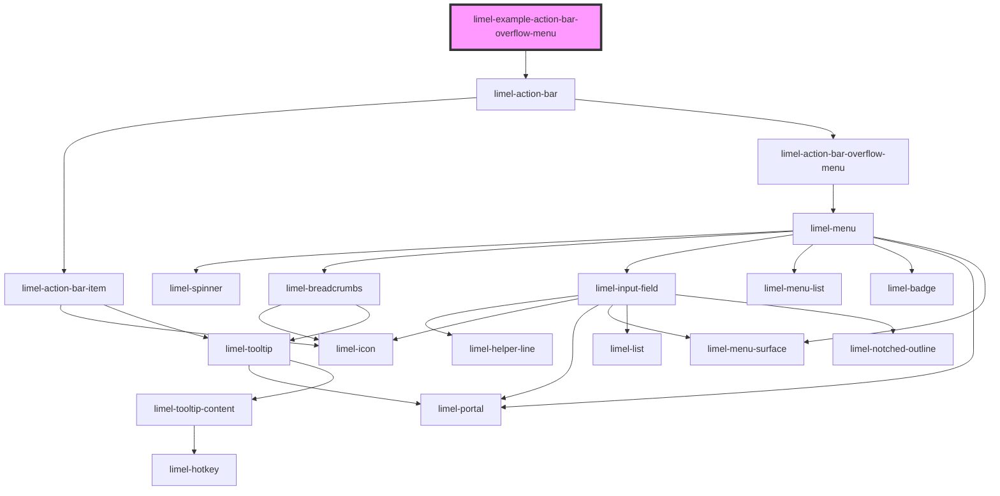

<!-- Auto Generated Below -->

## Overview

Overflow menu
When the action bar items don't fit in the available space,
an overflow button is automatically added as the last item on the action bar.

The menu indicates the quantity of the actions which are currently invisible for the users.
Clicking on the overflow button opens a menu with the remaining actions that didn't fit
in the available space.

## Dependencies

### Depends on

- [limel-action-bar](..)

### Graph

----------------------------------------------

*Built with [StencilJS](https://stenciljs.com/)*
