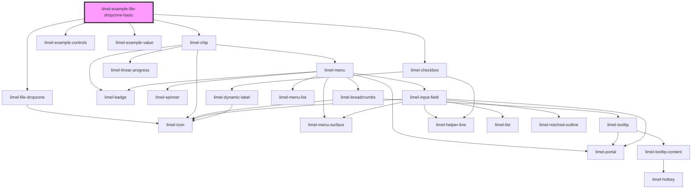

<!-- Auto Generated Below -->

## Overview

Basic example

## Dependencies

### Depends on

- [limel-file-dropzone](..)
- [limel-chip](../../chip)
- [limel-example-controls](../../../examples)
- [limel-checkbox](../../checkbox)
- [limel-example-value](../../../examples)

### Graph

----------------------------------------------

*Built with [StencilJS](https://stenciljs.com/)*
