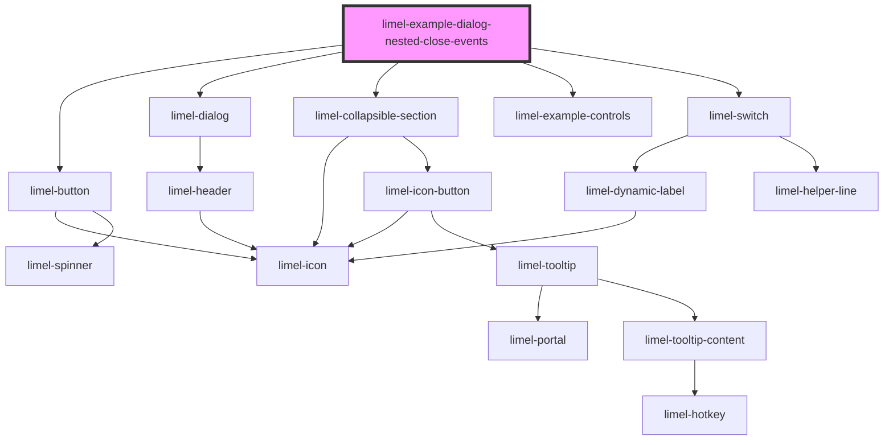

<!-- Auto Generated Below -->

## Overview

Nested `close` events

When putting other elements that emit `close` events inside a dialog, those
events must be caught and stopped inside the dialog. If not, they will bubble
to the event handler listening for `close` events on the dialog, which will
close the dialog too.

This example has an event handler for the `close` event on the dialog, and
a second event handler for the `close` event on the collapsible-section.

Try it out with the _Stop the inner close-event_ switch disabled, and then
with the switch enabled, to see the difference.

## Dependencies

### Depends on

- [limel-button](../../button)
- [limel-dialog](..)
- [limel-collapsible-section](../../collapsible-section)
- [limel-example-controls](../../../examples)
- [limel-switch](../../switch)

### Graph

----------------------------------------------

*Built with [StencilJS](https://stenciljs.com/)*
